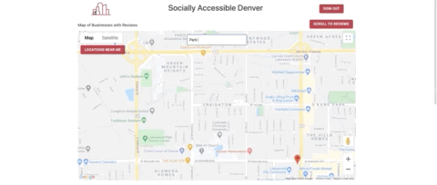

# Socially Accessible Denver (Front End) 
## Technologies 
React.js, Material Ui, Google Places API, and Google Maps Javascript API. 

## Features

 
The application first directs users to a sign in page. This was created using material Ui. Signing out will direct users back to the sign in page, and there is a link on the sign in page to sign in as a new user. 
 

Map Features 

Add Location

Add Review

## Challenges and Future Implementation

## Demo Video 

## How to Open 

## Contact 
You can find me on [LinkedIn](https://www.linkedin.com/in/jagrenier/)
